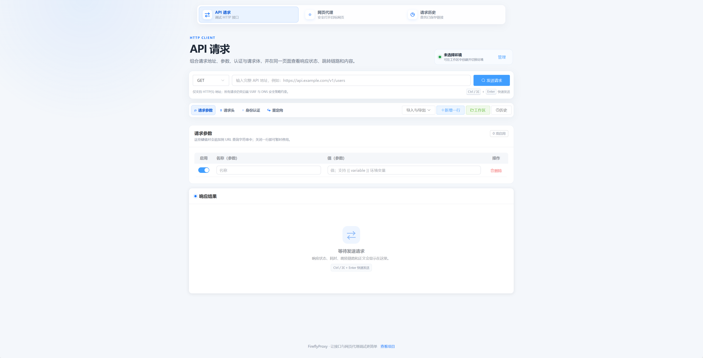

<div align="center">
  
  <h1>FireflyProxy</h1>
  <p><strong>中文 API 调试与安全网页代理工作台</strong></p>
  <p>在浏览器中组合 HTTP 请求、检查响应，并通过受控的 Browser Proxy 调试网页。</p>

  <p>
    
    
    
    
  </p>

  <p>
    <a href="#-主要能力">主要能力</a> ·
    <a href="#-快速开始">快速开始</a> ·
    <a href="#%EF%B8%8F-配置说明">配置说明</a> ·
    <a href="#-安全边界">安全边界</a> ·
    <a href="#-测试与验收">测试与验收</a>
  </p>
</div>

---

FireflyProxy 是一个面向本地开发与受信网络的浏览器代理调试项目，由 Vue 3 前端和 Node.js 后端组成。它同时提供 API 请求工作台、网页代理入口、请求历史、环境变量与管理控制台，并将 URL、DNS、SSRF、重定向和连接安全校验集中在后端处理。

> [!WARNING]
> FireflyProxy 不是可直接暴露到公网的开放代理。生产部署前必须配置身份认证、HTTPS、可信 CORS Origin、独立 Browser Origin、强 Session Secret，并理解下文列出的安全边界。

## 🖼️ 界面预览

<p align="center">
  
</p>

## ✨ 主要能力

| 模块 | 能力 |
| --- | --- |
| API 请求 | GET、POST、PUT、DELETE、PATCH、HEAD；查询参数、请求头、请求体、认证与重定向控制 |
| 请求体 | JSON、原始文本、URL 编码表单、multipart 文本与文件 |
| 响应检查 | HTTP 状态、总耗时、响应大小、Content-Type、最终 URL、重定向链及媒体/文件预览 |
| 网页代理 | HTML/CSS/Location 重写、Cookie Jar、Runtime Bridge、WebSocket 与可选 Origin Isolation |
| 本地工作区 | 环境变量、Session/持久化作用域、文件夹、已保存请求与敏感变量提醒 |
| 请求历史 | 本地搜索、复制、重新打开、损坏数据容错和移动端卡片视图 |
| 管理控制台 | 中文设置说明、配置搜索、明暗主题、单位换算、规则模板、原子写入和热加载 |
| 安全内核 | HTTP(S) 限制、URL credentials 拒绝、DNS 全量校验、SSRF 防护、连接 Pinning、并发与大小上限 |

### 前端体验

- API 请求、网页代理和请求历史采用统一的中文响应式界面。
- 390px 移动视口下无页面级横向溢出。
- `Ctrl / ⌘ + Enter` 可快速发送 API 请求。
- 网页代理兼容能力均提供用途说明，并明确不可信脚本与来源隔离风险。
- 历史记录和工作区只保存在当前浏览器，不会自动上传或跨设备同步。

## 🚀 快速开始

### 环境要求

- Node.js `22.16.0+`
- npm（随 Node.js 安装）

### 1. 启动后端

```powershell
Set-Location .\backend\nodejs
npm ci
Copy-Item ..\main.json.example .\main.json
$env:FIREFLYPROXY_SESSION_SECRET = "请替换为足够长的随机值"
npm start
```

默认监听地址：`http://localhost:8082`。

> `main.json` 包含认证和 Session 配置，已被 `.gitignore` 排除，请勿提交真实密码或 Secret。

### 2. 启动前端

另开一个终端：

```powershell
Set-Location .\vue-request-app
npm ci
npm run serve
```

开发地址：`http://localhost:8080/web/`。

前端默认连接 `http://localhost:8082`，也可以在启动或构建前分别指定：

```powershell
$env:VUE_APP_PROXY_API_URL = "https://api.proxy.example.com"
$env:VUE_APP_PROXY_BROWSE_URL = "https://browse.proxy.example.net"
npm run serve
```

### 3. 生产构建

```powershell
Set-Location .\vue-request-app
npm run build
```

构建产物位于 `vue-request-app/dist/`。后端从 `backend/nodejs/webPro/` 提供静态前端，如需由同一 Node.js 进程托管，请将 `dist/` 内容部署到该目录。

## ⚙️ 配置说明

配置模板位于 [`backend/main.json.example`](./backend/main.json.example)，后端从其当前工作目录读取 `main.json`。

| 配置 | 说明 |
| --- | --- |
| `port` | 后端监听端口，修改后需重启 |
| `user` / `pwd` | 代理自身 Basic Auth；两者均非空时启用 |
| `admin.*` | 管理控制台开关、路径与独立认证 |
| `session.*` | Session Cookie 名称、生命周期与安全属性 |
| `cors.allowedOrigins` | 允许访问 API 的浏览器 Origin |
| `security.blockedHostnames` | 精确主机或 `*.example.com` 子域阻止规则 |
| `api.*` | API 重定向、连接超时、请求体与并发限制 |
| `browser.*` | 网页代理、重写、Cookie、Runtime、WebSocket 与来源隔离 |
| `browser.responseTransform.*` | 按 Host、路径和 MIME 限定的内容替换规则 |
| `browser.publicCache.*` | 匿名公开静态资源缓存；默认关闭 |
| `runtimeState.*` | `memory` 或单机多进程共享的 `sqlite` 状态后端 |

管理控制台默认关闭。设置 `admin.enabled: true` 并配置独立的 `admin.user`、`admin.pwd` 后，可访问默认地址 `http://localhost:8082/admin`。

## 🔌 接口与兼容性

当前 API 与 Browser Route：

```text
ANY /__proxyweb/api?url=<percent-encoded-target>
GET /__proxyweb/browser?url=<percent-encoded-target>
```

`/__proxyweb/*` 和 `X-ProxyWeb-*` 是早期版本已经公开的线协议标识。项目品牌已更名为 FireflyProxy，但这些标识会继续保留兼容，避免旧分享链接、客户端和诊断工具失效。新前端发送上游认证时使用：

```text
X-FireflyProxy-Upstream-Authorization: Bearer <token>
```

后端仍接受旧的 `X-ProxyWeb-Upstream-Authorization`，仅用于兼容迁移。

## 🛡️ 安全边界

- 仅接受不含用户名和密码的 HTTP(S) 目标 URL。
- DNS 校验覆盖全部 A/AAAA 结果，拒绝 loopback、private、link-local、multicast、reserved 等非公网地址。
- 每次实际连接都绑定已验证地址，并保持原始 Host、SNI 与 TLS 证书校验。
- API 重定向逐跳重新执行 URL、DNS、SSRF 与 Pinning 校验；跨 Origin 会删除认证和敏感请求头。
- Browser Proxy 会执行目标站点提供的不可信 JavaScript，生产环境必须与管理界面使用不同 Origin。
- 工作区的持久化变量、请求集合和历史记录没有加密；“敏感”标记仅负责遮罩与风险提醒。
- 公共静态缓存、Runtime Bridge、Script Cookie Bridge、WebSocket 和 Origin Isolation 均需按部署需要显式配置。
- 不应把目标 Token、密码或其他凭据放入可分享 URL。

更完整的后端配置与部署细节见 [`backend/nodejs/README.md`](./backend/nodejs/README.md)，前端使用说明见 [`vue-request-app/README.md`](./vue-request-app/README.md)。

## 🧪 测试与验收

### 前端

```powershell
Set-Location .\vue-request-app
npm test
npm run lint
npm run build
```

### 后端

```powershell
Set-Location .\backend\nodejs
npm test
npm run lint
```

真实浏览器专项：

```powershell
npm run test:workspace:e2e
npm run test:admin:e2e
npm run test:e2e
```

## 📁 项目结构

```text
FireflyProxy/
├── backend/
│   ├── main.json.example       # 后端配置模板
│   └── nodejs/
│       ├── admin-console/      # 管理控制台
│       ├── api-proxy/          # API Route 与请求控制
│       ├── browser-proxy/      # Browser Route、重写与会话能力
│       ├── config/             # 默认配置、Schema 与加载器
│       ├── core/               # 安全网络内核
│       ├── middleware/         # 认证、CORS、日志与兼容层
│       └── tests/              # 单元、集成及真实浏览器测试
├── vue-request-app/
│   ├── public/                 # favicon 与 HTML 模板
│   ├── src/                    # Vue 3 应用源码
│   └── tests/                  # 前端逻辑测试
└── scripts/                    # 分阶段自动化门禁
```

## 📄 License

Copyright © 2026 [流萤可爱捏](https://github.com/Iskongkongyo)。

本项目采用 [MIT License](./LICENSE) 开源；你可以自由使用、复制、修改、合并、发布和分发，但须保留原始版权声明和许可声明。
