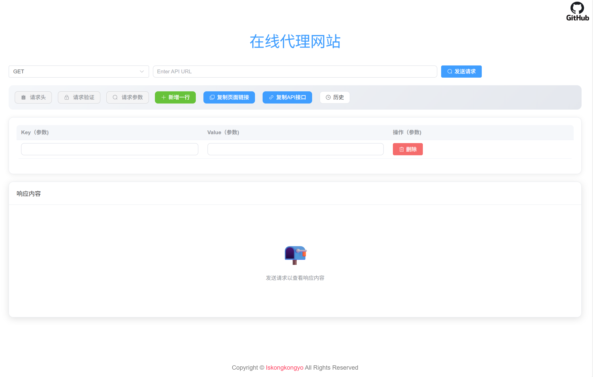

# proxyWeb

轻量的浏览器 API 调试界面与 Node.js HTTP 代理实验项目。当前版本可用于本地开发和受信网络中的 API 调试；vNext 计划在此基础上补齐安全边界、测试体系和 Browser Proxy 能力。



> [!WARNING]
> 当前后端尚未完成 DNS 级 SSRF 校验、重定向逐跳校验和代理认证头隔离，**不要直接暴露到公网，也不要把它当作生产级开放代理**。完整问题和改造顺序见 [vNext 开发计划与技术方案](./proxyWeb%20vNext%20开发计划与技术方案.md)。

## 当前能力

| 模块 | 已实现 |
| --- | --- |
| API 请求 | GET、POST、PUT、DELETE、PATCH、HEAD；查询参数；自定义请求头 |
| 请求体 | URL 编码表单、multipart 文件、JSON、纯文本 |
| 上游认证 | Basic Auth、Bearer Token |
| 响应 | JSON/文本格式化、响应头、图片/音视频预览、文件下载 |
| 本地功能 | 响应式界面、分享链接、浏览器本地历史记录 |
| 后端 | 流式转发、Session 目标地址、限流、日志、部分配置热加载 |

当前并没有完整的网页反向代理模式；HTML/CSS URL 重写、Cookie Jar、WebSocket 和 SPA 兼容属于 vNext 规划，而不是已完成功能。

## 目录结构

```text
proxyWeb/
├── backend/
│   ├── main.json.example        # 后端配置模板
│   ├── echo.js                  # 独立回显服务（开发辅助）
│   └── nodejs/
│       ├── main.js              # Node.js 代理入口
│       ├── main.json            # 当前本地配置
│       └── README.md            # 后端说明
├── vue-request-app/             # Vue 3 前端
│   ├── src/
│   ├── package.json
│   └── README.md                # 前端说明
├── docs/
│   └── vnext-implementation-roadmap.md  # vNext 分阶段实施路线图
└── proxyWeb vNext 开发计划与技术方案.md
```

## 快速开始

建议使用 Node.js 22+。前后端均已提交依赖锁文件，使用 `npm ci` 可复现安装。

### 1. 启动后端

在仓库根目录执行：

```powershell
Set-Location .\backend\nodejs
npm ci
npm start
```

后端从**当前工作目录**读取 `./main.json`，因此应在 `backend/nodejs/` 内启动。若该文件不存在，可先把 `../main.json.example` 复制为 `./main.json`，并至少修改 `session.secret`。

默认监听 `http://localhost:8082`。

### 2. 启动前端

另开一个终端，在仓库根目录执行：

```powershell
Set-Location .\vue-request-app
npm ci
npm run serve
```

由于前端的 `publicPath` 和路由基址都是 `/web/`，开发地址是：

```text
http://localhost:8080/web/
```

前端默认请求 `http://localhost:8082`。如需修改，在启动或构建前设置 `VUE_APP_PROXY_URL`；这是 Vue CLI 的**构建时变量**：

```powershell
$env:VUE_APP_PROXY_URL = "https://proxy.example.com"
npm run serve
```

### 3. 生产构建

```powershell
Set-Location .\vue-request-app
npm run build
```

产物位于 `vue-request-app/dist/`。后端只会从其工作目录下的 `webPro/` 提供静态文件，因此若希望由 Node.js 一并托管前端，需要把 `dist/` 的内容部署到 `backend/nodejs/webPro/`，然后访问后端的 `/web/`。

## 配置

以 [backend/main.json.example](./backend/main.json.example) 为当前配置格式参考。常用字段如下：

| 字段 | 单位/含义 | 是否可热加载 |
| --- | --- | --- |
| `port` | 监听端口 | 否，需重启 |
| `timeout` | 上游请求超时，秒 | 是 |
| `user` / `pwd` | 代理自身 Basic Auth；两者均非空时启用 | 是 |
| `accessOrigin` | CORS 来源 | 是 |
| `session.secret` | Session 签名密钥 | 否，需重启 |
| `session.cookie.maxAge` | Cookie 生命周期，毫秒 | 否，需重启 |
| `limiter.windowMs` | 限流窗口，毫秒 | 是 |
| `limiter.max` | 每个窗口的请求数 | 是 |
| `blacklist` | 被拼接为正则表达式的字符串列表 | 是 |
| `max_redirects` | Axios 自动重定向上限 | 是 |

`backend/nodejs/main.json` 中若仍使用 `cookie_max_age`、`cookie_secure`、`cookie_httponly` 等旧字段，当前代码不会把它们映射到 `session.cookie`；请按示例文件改为嵌套格式。

## 当前安全边界

- 只会拦截 URL 中直接出现的 localhost 和非公网 IP；域名解析结果尚未校验，存在 DNS SSRF / DNS Rebinding 风险。
- Axios 自动跟随重定向，跳转后的每一跳尚未重新执行目标校验。
- 代理自身 Basic Auth 和上游 `Authorization` 仍共用请求头路径，代理凭据可能被转发到目标站点。
- `headers` 查询参数、分享链接、请求日志和浏览器历史可能包含 Token。不要在当前版本中使用真实生产凭据。
- `accessOrigin: "*"` 会反射请求 Origin 并允许 Credentials，不应作为公网配置。
- `trust proxy` 当前硬编码为 `1`；实际代理层数不同会影响客户端 IP 与限流判断。
- Session 使用进程内存存储，不适合多实例或长期生产运行。

这些问题已作为 vNext P0 阻塞项记录。更详细的运行方式与限制见 [后端文档](./backend/nodejs/README.md)，前端数据与构建说明见 [前端文档](./vue-request-app/README.md)。

## 文档索引

- [前端 README](./vue-request-app/README.md)
- [Node.js 后端 README](./backend/nodejs/README.md)
- [vNext 开发计划与技术方案](./proxyWeb%20vNext%20开发计划与技术方案.md)
- [vNext 分阶段实施路线图](./docs/vnext-implementation-roadmap.md)

## 许可证状态

仓库当前没有 `LICENSE` 文件，因此暂不声明具体开源许可证。发布或接受外部贡献前，建议补充正式许可证文件，并再恢复许可证徽章与声明。
